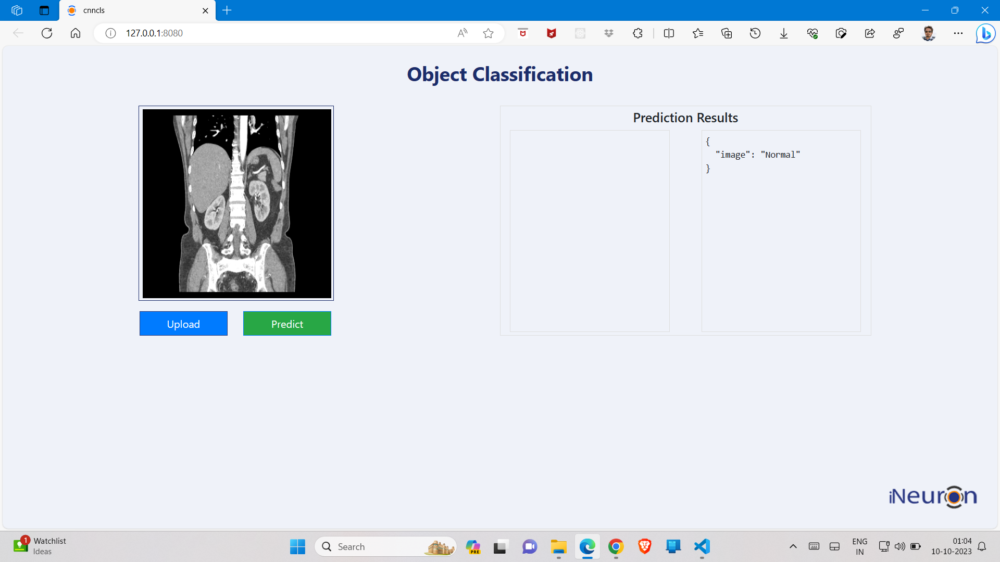
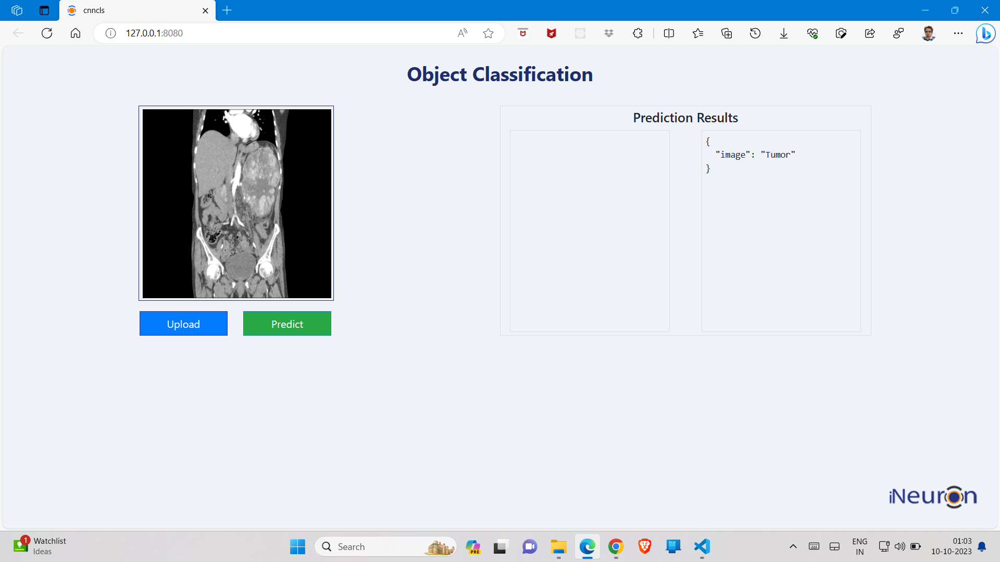

# Kidney-Disease-Classification-MLflow-DVC


## Demo 

<div>
    
    
</div>


## Workflows

1. Update config.yaml
2. Update secrets.yaml [Optional]
3. Update params.yaml
4. Update the entity
5. Update the configuration manager in src config
6. Update the components
7. Update the pipeline 
8. Update the main.py
9. Update the dvc.yaml
10. Update the app.py

# How to run?
### STEPS:

Clone the repository

```bash
https://github.com/GauravPahwa2021/Kidney_Disease_Prediction
```
### STEP 01- Create a conda environment after opening the repository

```bash
conda create -n cnncls python=3.8 -y
```

```bash
conda activate cnncls
```


### STEP 02- install the requirements
```bash
pip install -r requirements.txt
```

```bash
# Finally run the following command
python app.py
```

Now,
```bash
open up you local host and port
```

## MLflow

- [Documentation](https://mlflow.org/docs/latest/index.html)

- [MLflow tutorial](https://youtu.be/qdcHHrsXA48?si=bD5vDS60akNphkem)

##### cmd
- mlflow ui

### dagshub
[dagshub](https://dagshub.com/)

MLFLOW_TRACKING_URI=https://dagshub.com/GauravPahwa2021/Kidney_Disease_Prediction.mlflow \
MLFLOW_TRACKING_USERNAME=GauravPahwa2021 \
MLFLOW_TRACKING_PASSWORD=34255e2baf836bf6327d7bb761b9ef93d83d0201 \
python script.py

Run this to export as env variables:

```bash

export MLFLOW_TRACKING_URI=https://dagshub.com/GauravPahwa2021/Kidney_Disease_Prediction.mlflow

export MLFLOW_TRACKING_USERNAME=GauravPahwa2021

export MLFLOW_TRACKING_PASSWORD=34255e2baf836bf6327d7bb761b9ef93d83d0201

```

### DVC cmd

1. dvc init
2. dvc repro
3. dvc dag


## About MLflow & DVC

MLflow

 - Its Production Grade
 - Trace all of your expriements
 - Logging & taging your model


DVC 

 - Its very lite weight for POC only
 - lite weight expriements tracker
 - It can perform Orchestration (Creating Pipelines)


